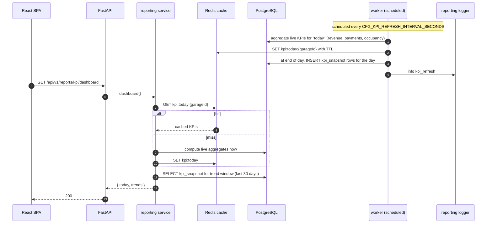

# Sequence — KPI Refresh (Dashboard)

```mermaid
sequenceDiagram
    autonumber
    participant SPA as React SPA
    participant API as FastAPI
    participant REP as reporting service
    participant CACHE as Redis cache
    participant DB as PostgreSQL
    participant WKR as worker (scheduled)
    participant LOG as reporting logger

    Note over WKR: scheduled every CFG_KPI_REFRESH_INTERVAL_SECONDS
    WKR->>DB: aggregate live KPIs for "today" (revenue, payments, occupancy)
    WKR->>CACHE: SET kpi:today:{garageId} with TTL
    WKR->>DB: at end of day, INSERT kpi_snapshot rows for the day
    WKR->>LOG: info kpi_refresh

    SPA->>API: GET /api/v1/reports/kpi/dashboard
    API->>REP: dashboard()
    REP->>CACHE: GET kpi:today:{garageId}
    alt hit
        CACHE-->>REP: cached KPIs
    else miss
        REP->>DB: compute live aggregates now
        REP->>CACHE: SET kpi:today
    end
    REP->>DB: SELECT kpi_snapshot for trend window (last 30 days)
    REP-->>API: { today, trends }
    API-->>SPA: 200
```
