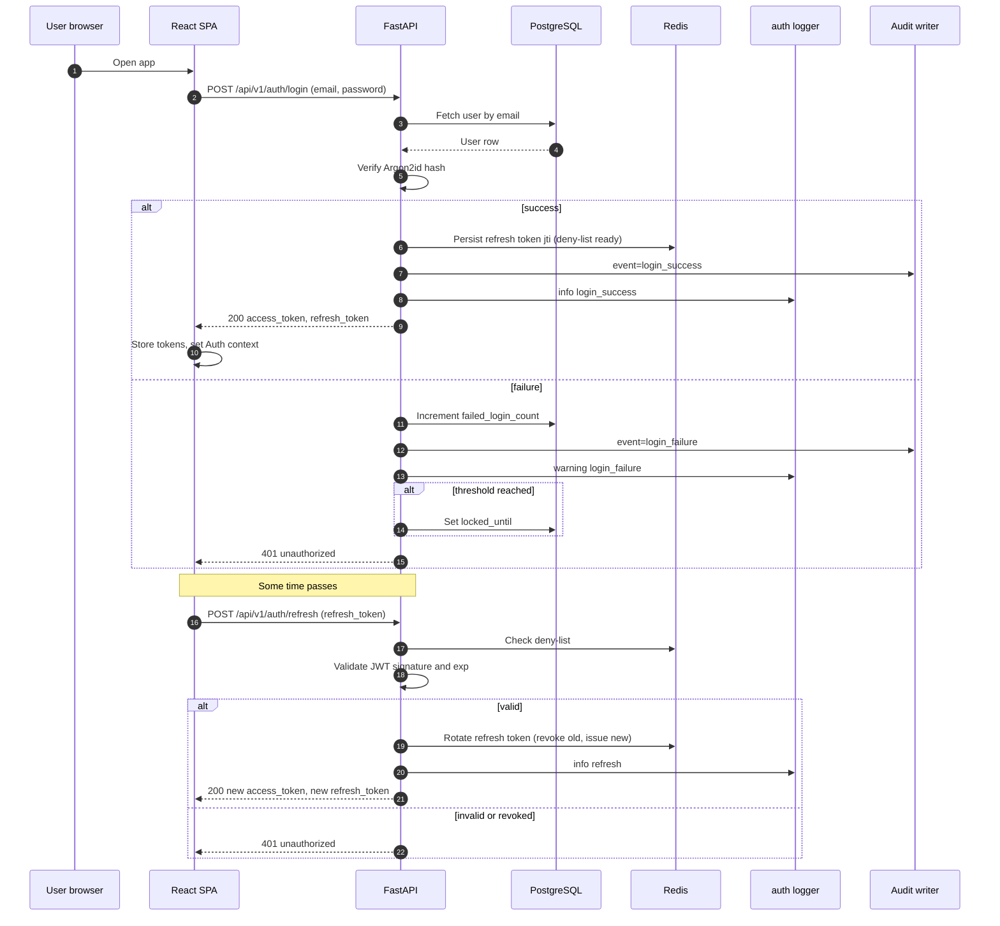

# Sequence — Login and Token Refresh

```mermaid
sequenceDiagram
    autonumber
    participant U as User browser
    participant SPA as React SPA
    participant API as FastAPI
    participant DB as PostgreSQL
    participant RED as Redis
    participant LOG as auth logger
    participant AUD as Audit writer

    U->>SPA: Open app
    SPA->>API: POST /api/v1/auth/login (email, password)
    API->>DB: Fetch user by email
    DB-->>API: User row
    API->>API: Verify Argon2id hash
    alt success
        API->>RED: Persist refresh token jti (deny-list ready)
        API->>AUD: event=login_success
        API->>LOG: info login_success
        API-->>SPA: 200 access_token, refresh_token
        SPA->>SPA: Store tokens, set Auth context
    else failure
        API->>DB: Increment failed_login_count
        API->>AUD: event=login_failure
        API->>LOG: warning login_failure
        alt threshold reached
            API->>DB: Set locked_until
        end
        API-->>SPA: 401 unauthorized
    end

    Note over SPA,API: Some time passes

    SPA->>API: POST /api/v1/auth/refresh (refresh_token)
    API->>RED: Check deny-list
    API->>API: Validate JWT signature and exp
    alt valid
        API->>RED: Rotate refresh token (revoke old, issue new)
        API->>LOG: info refresh
        API-->>SPA: 200 new access_token, new refresh_token
    else invalid or revoked
        API-->>SPA: 401 unauthorized
    end
```
