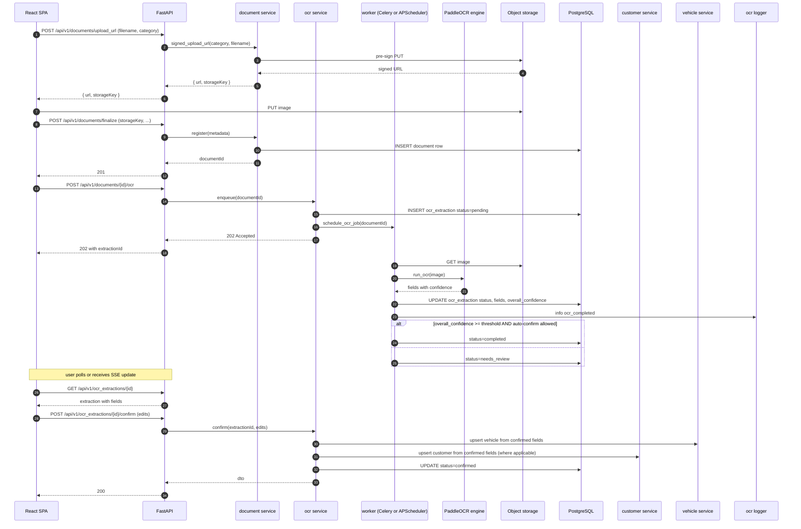

# Sequence — OCR Pipeline (registration card or ID)

```mermaid
sequenceDiagram
    autonumber
    participant SPA as React SPA
    participant API as FastAPI
    participant DOC as document service
    participant OCR as ocr service
    participant WKR as worker (Celery or APScheduler)
    participant PAD as PaddleOCR engine
    participant OBJ as Object storage
    participant DB as PostgreSQL
    participant CUST as customer service
    participant VEH as vehicle service
    participant LOG as ocr logger

    SPA->>API: POST /api/v1/documents/upload_url (filename, category)
    API->>DOC: signed_upload_url(category, filename)
    DOC->>OBJ: pre-sign PUT
    OBJ-->>DOC: signed URL
    DOC-->>API: { url, storageKey }
    API-->>SPA: { url, storageKey }
    SPA->>OBJ: PUT image
    SPA->>API: POST /api/v1/documents/finalize (storageKey, ...)
    API->>DOC: register(metadata)
    DOC->>DB: INSERT document row
    DOC-->>API: documentId
    API-->>SPA: 201

    SPA->>API: POST /api/v1/documents/{id}/ocr
    API->>OCR: enqueue(documentId)
    OCR->>DB: INSERT ocr_extraction status=pending
    OCR->>WKR: schedule_ocr_job(documentId)
    OCR-->>API: 202 Accepted
    API-->>SPA: 202 with extractionId

    WKR->>OBJ: GET image
    WKR->>PAD: run_ocr(image)
    PAD-->>WKR: fields with confidence
    WKR->>DB: UPDATE ocr_extraction status, fields, overall_confidence
    WKR->>LOG: info ocr_completed
    alt overall_confidence >= threshold AND auto-confirm allowed
        WKR->>DB: status=completed
    else
        WKR->>DB: status=needs_review
    end

    Note over SPA,API: user polls or receives SSE update

    SPA->>API: GET /api/v1/ocr_extractions/{id}
    API-->>SPA: extraction with fields

    SPA->>API: POST /api/v1/ocr_extractions/{id}/confirm (edits)
    API->>OCR: confirm(extractionId, edits)
    OCR->>VEH: upsert vehicle from confirmed fields
    OCR->>CUST: upsert customer from confirmed fields (where applicable)
    OCR->>DB: UPDATE status=confirmed
    OCR-->>API: dto
    API-->>SPA: 200
```
