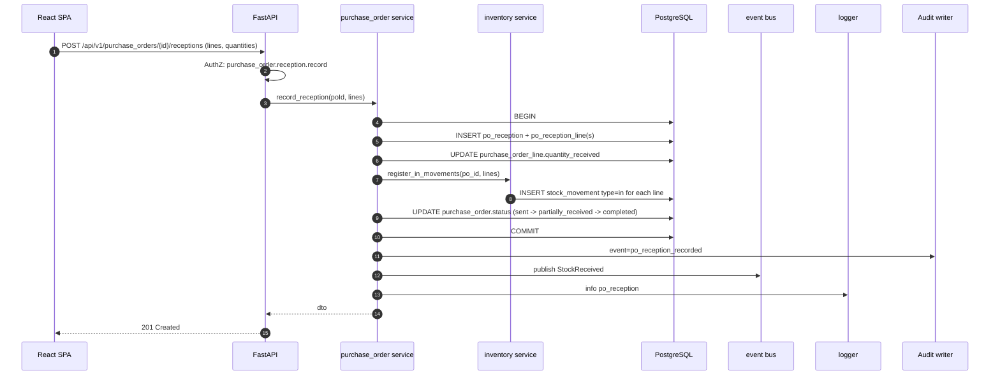

# Sequence — Purchase Order Reception

```mermaid
sequenceDiagram
    autonumber
    participant SPA as React SPA
    participant API as FastAPI
    participant PO as purchase_order service
    participant INV as inventory service
    participant DB as PostgreSQL
    participant EVT as event bus
    participant LOG as logger
    participant AUD as Audit writer

    SPA->>API: POST /api/v1/purchase_orders/{id}/receptions (lines, quantities)
    API->>API: AuthZ: purchase_order.reception.record
    API->>PO: record_reception(poId, lines)
    PO->>DB: BEGIN
    PO->>DB: INSERT po_reception + po_reception_line(s)
    PO->>DB: UPDATE purchase_order_line.quantity_received
    PO->>INV: register_in_movements(po_id, lines)
    INV->>DB: INSERT stock_movement type=in for each line
    PO->>DB: UPDATE purchase_order.status (sent -> partially_received -> completed)
    PO->>DB: COMMIT
    PO->>AUD: event=po_reception_recorded
    PO->>EVT: publish StockReceived
    PO->>LOG: info po_reception
    PO-->>API: dto
    API-->>SPA: 201 Created
```
