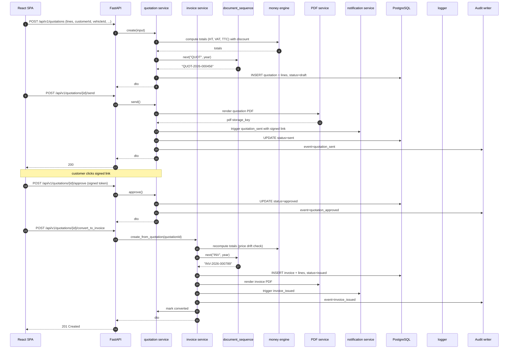

# Sequence — Quotation to Invoice

```mermaid
sequenceDiagram
    autonumber
    participant SPA as React SPA
    participant API as FastAPI
    participant QUOT as quotation service
    participant INVO as invoice service
    participant DOC as document_sequence
    participant MNY as money engine
    participant PDF as PDF service
    participant NOTIF as notification service
    participant DB as PostgreSQL
    participant LOG as logger
    participant AUD as Audit writer

    SPA->>API: POST /api/v1/quotations (lines, customerId, vehicleId, ...)
    API->>QUOT: create(input)
    QUOT->>MNY: compute totals (HT, VAT, TTC) with discount
    MNY-->>QUOT: totals
    QUOT->>DOC: next("QUOT", year)
    DOC-->>QUOT: "QUOT-2026-000456"
    QUOT->>DB: INSERT quotation + lines, status=draft
    QUOT-->>API: dto

    SPA->>API: POST /api/v1/quotations/{id}/send
    API->>QUOT: send()
    QUOT->>PDF: render quotation PDF
    PDF-->>QUOT: pdf storage_key
    QUOT->>NOTIF: trigger quotation_sent with signed link
    QUOT->>DB: UPDATE status=sent
    QUOT->>AUD: event=quotation_sent
    QUOT-->>API: dto
    API-->>SPA: 200

    Note over SPA,QUOT: customer clicks signed link

    SPA->>API: POST /api/v1/quotations/{id}/approve (signed token)
    API->>QUOT: approve()
    QUOT->>DB: UPDATE status=approved
    QUOT->>AUD: event=quotation_approved
    QUOT-->>API: dto

    SPA->>API: POST /api/v1/quotations/{id}/convert_to_invoice
    API->>INVO: create_from_quotation(quotationId)
    INVO->>MNY: recompute totals (price drift check)
    INVO->>DOC: next("INV", year)
    DOC-->>INVO: "INV-2026-000789"
    INVO->>DB: INSERT invoice + lines, status=issued
    INVO->>PDF: render invoice PDF
    INVO->>NOTIF: trigger invoice_issued
    INVO->>AUD: event=invoice_issued
    INVO->>QUOT: mark converted
    INVO-->>API: dto
    API-->>SPA: 201 Created
```
