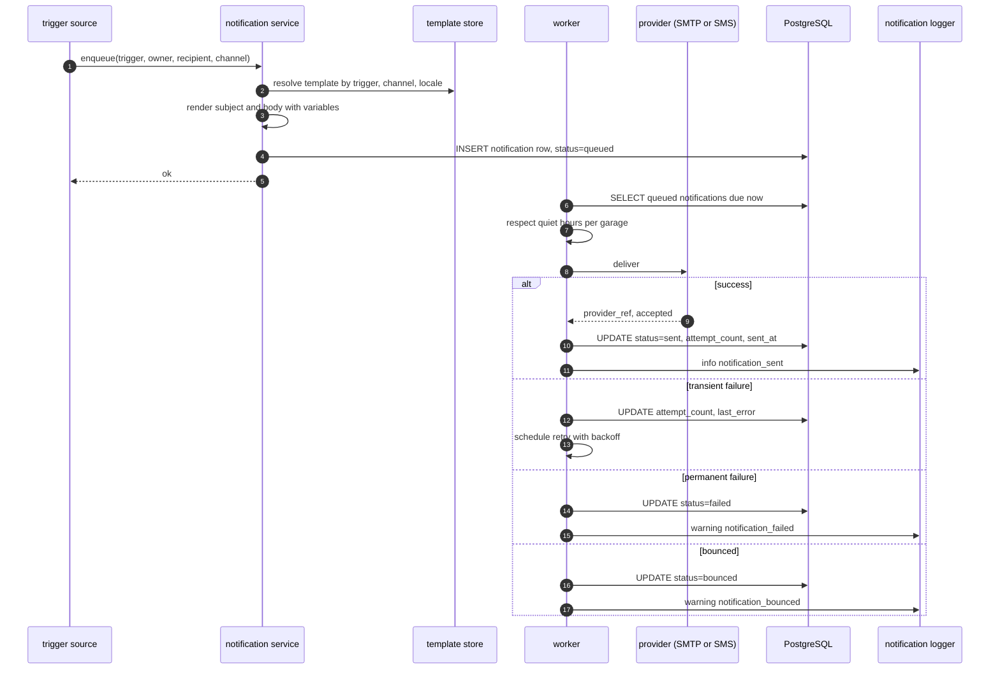

# Sequence — Send Notification (vehicle ready or reminder)

```mermaid
sequenceDiagram
    autonumber
    participant TRG as trigger source
    participant NOT as notification service
    participant TPL as template store
    participant WKR as worker
    participant PROV as provider (SMTP or SMS)
    participant DB as PostgreSQL
    participant LOG as notification logger

    TRG->>NOT: enqueue(trigger, owner, recipient, channel)
    NOT->>TPL: resolve template by trigger, channel, locale
    NOT->>NOT: render subject and body with variables
    NOT->>DB: INSERT notification row, status=queued
    NOT-->>TRG: ok

    WKR->>DB: SELECT queued notifications due now
    WKR->>WKR: respect quiet hours per garage
    WKR->>PROV: deliver
    alt success
        PROV-->>WKR: provider_ref, accepted
        WKR->>DB: UPDATE status=sent, attempt_count, sent_at
        WKR->>LOG: info notification_sent
    else transient failure
        WKR->>DB: UPDATE attempt_count, last_error
        WKR->>WKR: schedule retry with backoff
    else permanent failure
        WKR->>DB: UPDATE status=failed
        WKR->>LOG: warning notification_failed
    else bounced
        WKR->>DB: UPDATE status=bounced
        WKR->>LOG: warning notification_bounced
    end
```
