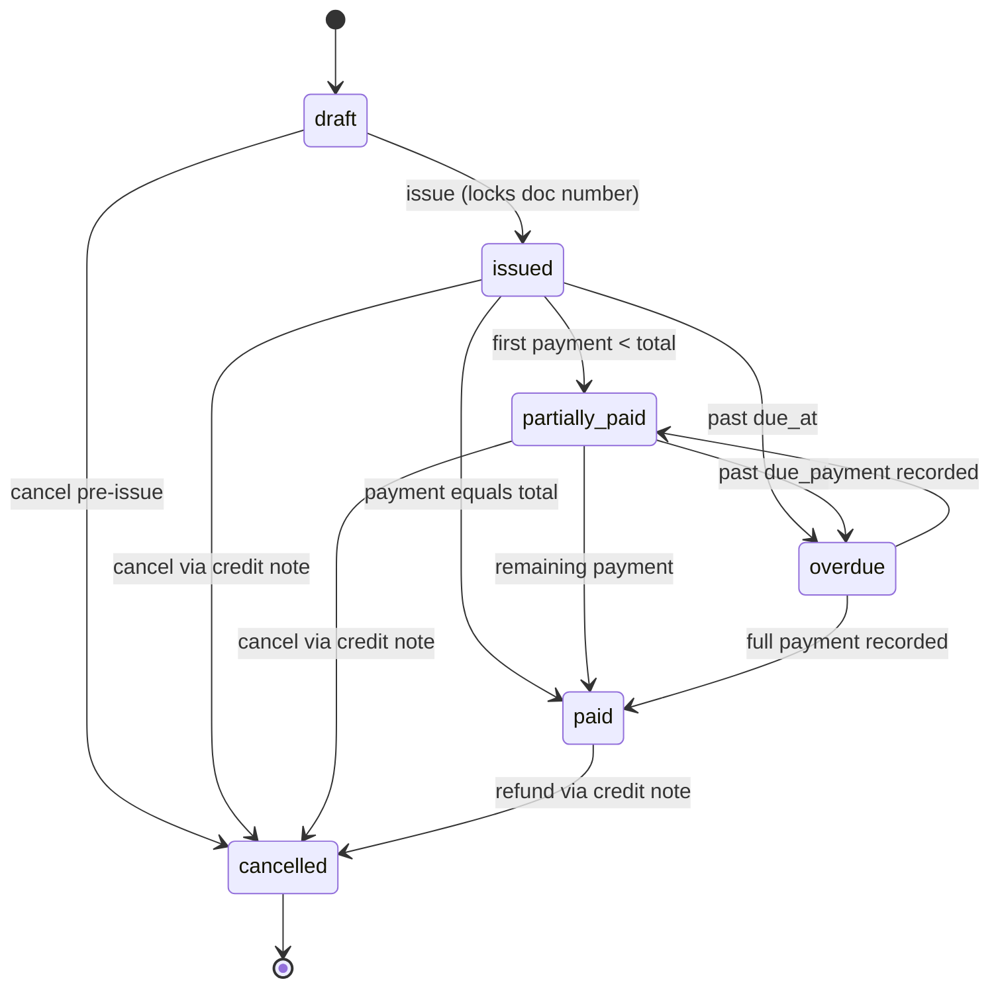

# State Machine — Invoice

```mermaid
stateDiagram-v2
    [*] --> draft
    draft --> issued : issue (locks doc number)
    draft --> cancelled : cancel pre-issue
    issued --> partially_paid : first payment < total
    issued --> paid : payment equals total
    issued --> overdue : past due_at
    partially_paid --> paid : remaining payment
    partially_paid --> overdue : past due_at
    overdue --> partially_paid : payment recorded
    overdue --> paid : full payment recorded
    issued --> cancelled : cancel via credit note
    partially_paid --> cancelled : cancel via credit note
    paid --> cancelled : refund via credit note
    cancelled --> [*]
```

`issued`, `partially_paid`, `paid`, `overdue` invoices are immutable except by issuing a `credit_note`. The header amounts of the invoice never change after `issued`.
