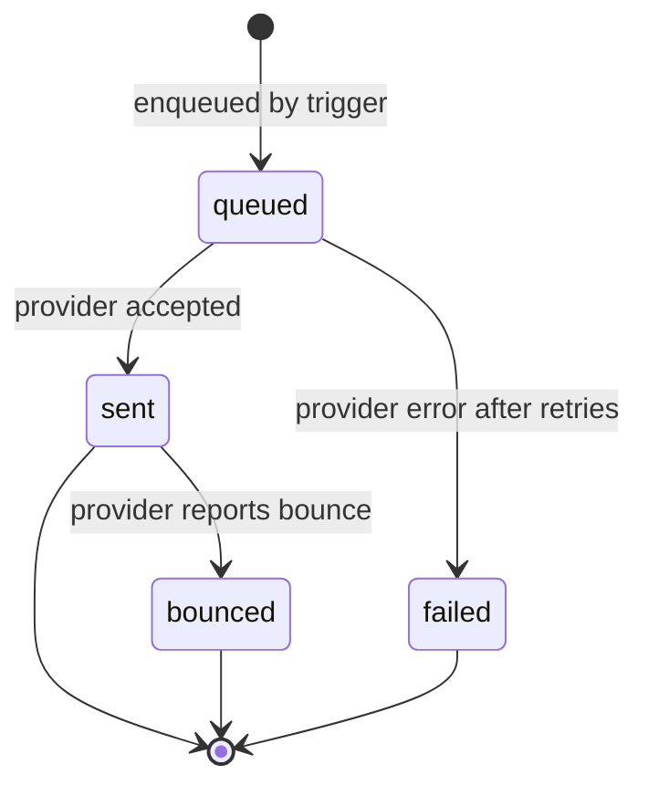

# State Machine — Notification

```mermaid
stateDiagram-v2
    [*] --> queued : enqueued by trigger
    queued --> sent : provider accepted
    queued --> failed : provider error after retries
    sent --> bounced : provider reports bounce
    sent --> [*]
    bounced --> [*]
    failed --> [*]
```

Retries are bounded by `CFG_NOTIFICATION_MAX_ATTEMPTS` with exponential backoff. `failed` and `bounced` surface in the delivery log and on the customer profile.
