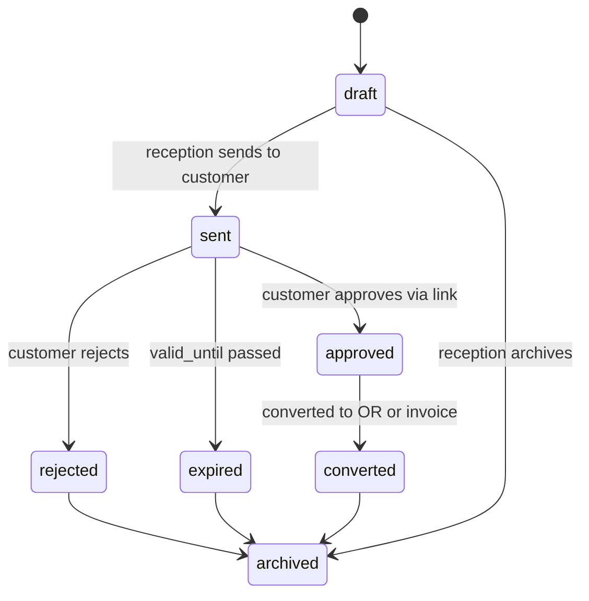

# State Machine — Quotation

```mermaid
stateDiagram-v2
    [*] --> draft
    draft --> sent : reception sends to customer
    sent --> approved : customer approves via link
    sent --> rejected : customer rejects
    sent --> expired : valid_until passed
    approved --> converted : converted to OR or invoice
    rejected --> archived
    expired --> archived
    converted --> archived
    draft --> archived : reception archives
```

Once `archived`, a quotation is read-only. Conversion from `expired` is blocked; reception must re-issue.
